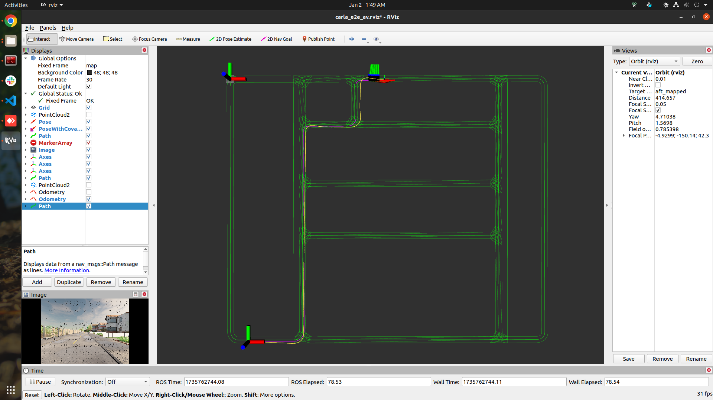
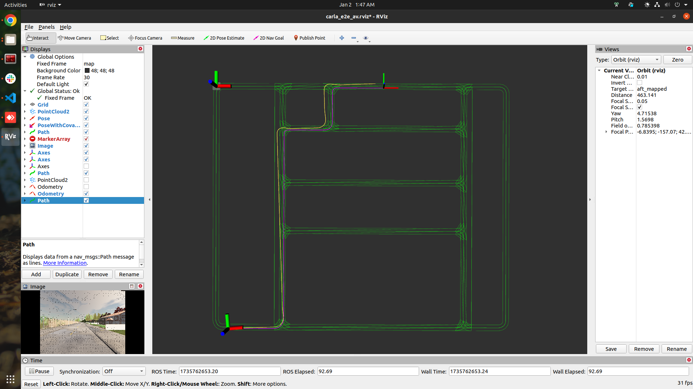

# Carla E2E AV Stack
This repository offers a ready-to-use perception and control stack for autonomous vehicles, designed to streamline development and testing in CARLA. With a simple plug-and-play approach, it provides a foundational pipeline for experimenting with perception algorithms and integrating outputs with planning and control, saving time and letting you focus on innovation.


<br>

currently its capable of,
- [x] load any town's lanelet map
- [x] spawn and set goal using rviz
- [x] Use A-LOAM or SC-A-LOAM for odometry.
- [x] evaluate odometry based on MSE-ATE, and scale error.
- [x] Waypoint following using PID control.
- [x] Run in both ROS1 and ROS2
- [ ] EKF sensor fusion of IMU and LiDAR 
- [ ] Add Occupancy grid carla E2E AV


## Articles:
- Setup ROS2 with Carla: https://learnopencv.com/ros2-and-carla-setup-guide/
- About building this project: https://learnopencv.com/pid-controller-ros-2-carla/
- LiDAR SLAM: https://learnopencv.com/lidar-slam-with-ros2/


## A-LOAM and SC-A-LOAM comparison

Below are two separate tables summarizing **A-LOAM** and **SC-A-LOAM** performance based on latency and memory.

| **A-LOAM**            | **SC-A-LOAM**                            |
|--------------------------|--------------------------------------|
|||
|||


---

### A-LOAM

| **Parameter**            | **Value**                            |
|--------------------------|--------------------------------------|
| **Odom Rate**            | 20 Hz (`/aft_mapped_path`)           |
| **Map Rate**             | 1 Hz (`/laser_cloud_map`)            |
| **RMS ATE**              | 0.9114 m                             |
| **Scale Error**          | 0.15%                                |
| **/alaserMapping**       | 159800 byte  (~159.8 KB)             |
| **/alaserOdometry**      | 142164 byte  (~142.164 KB)           |
| **/ascanRegistration**   | 32060 byte   (~32.06 KB)             |


### SC-A-LOAM

| **Parameter**                    | **Value**                            |
|----------------------------------|--------------------------------------|
| **Odom Rate**                    | 10 Hz (`/aft_pgo_path`)              |
| **Map Update**                   | 0.100 Hz (`/aft_pgo_map`)            |
| **Map Node**                     | 233.840 kb                           |
| **Odometry**                     | 142.240 kb                           |
| **PGO**                          | 110.800 kb                           |
| **Scan Registration**            | 32.004 kb                            |
| **RMS ATE**                      | 14 - 20 m                            |
| **Scale Error**                  | 0.37%                                |


### Download bagfile

- download carla a-loam [bagfile](https://drive.google.com/file/d/1OsF4wZUUtCnZyqNwcuIPoLS7GDt7DPz7/view?usp=sharing)
- download carla sc-a-loam [bagfile](https://drive.google.com/file/d/12v2dabtbnNHr0ifbTQOTaF4L7YG9pz3t/view?usp=sharing) 

### Comparison based on the a fixed trajectory

| **A-LOAM**            | **SC-A-LOAM**                            |
|--------------------------|--------------------------------------|
|||


## Dependency
- Carla 0.9.11
- ROS1 noetic and ROS2 humble
- Ceres Solver , PCL and PCL-conversitions


## Run ROS1 code

Run the AV stack without odometry from LOAM in ROS1

**build:**

```python
$ git clone https://github.com/soumya997/carla-e2e-av-stack.git
$ cd carla-e2e-av-stack/ros1_ws
$ catkin_make
$ source devel/setup.bash
```

Run the code:

```python
$ $CARLA_ROOT/CarlaUE4.sh -quality-level=Low -prefernvidia -nosound

$ cd /home/opencvuniv/carla-ros-bridge/catkin_ws && source devel/setup.bash
$ roslaunch carla_ros_bridge carla_ros_bridge.launch synchronous_mode:=True town:=Town01

$ cd /home/opencvuniv/carla-ros-bridge/catkin_ws && source devel/setup.bash
$ roslaunch carla_spawn_objects carla_example_ego_vehicle.launch spawn_sensors_only:=False objects_definition_file:=/home/opencvuniv/Work/somusan/robotics/nice_e2e_carla_av/trash/carla_e2e_ws/src/vehicle_ctrl/maps/objects.json

$ cd /home/opencvuniv/carla-ros-bridge/catkin_ws && source devel/setup.bash
$ roslaunch carla_waypoint_publisher carla_waypoint_publisher.launch

$ cd /home/opencvuniv/Work/somusan/robotics/nice_e2e_carla_av/trash/carla_e2e_ws && source devel/setup.bash
$ roslaunch vehicle_ctrl run_vehicle.launch

use the `2D Pose Estimate` to spawn a vehicle and `2D Nav Goal` to give the goal.
now, the car should be start running
```

### Run with A-LOAM/SC-A-LOAM Odometry


1. uncomment code under `# Subscriber to the LOAM odometry topic`, and comment out the code under `# Subscriber to the /carla/ego_vehicle/odometry topic`.
2. run A-LOAM code using the below code,

```python
$ roslaunch aloam_velodyne aloam_velodyne_VLP_16_v2.launch lidar_topic:=/carla/ego_vehicle/lidar
$ python src/loam_utils/scripts/static_trf_broadcast.py
$ python src/loam_utils/scripts/aloam_odom_trf.py
```

3. run A-LOAM code using the below code,

```python
$ roslaunch aloam_velodyne aloam_mulran.launch
$ python src/loam_utils/scripts/static_trf_broadcast.py
$ python src/loam_utils/scripts/aloam_odom_trf.py
```


### Run ROS2 code
Run the AV stack without odometry from LOAM in ROS1. LOAM dont have ROS2 support, so uncomment the code under `# Subscriber to the /carla/ego_vehicle/odometry topic` and comment the code under `# Subscriber to the LOAM odometry topic`. 

```python
# in a new terminal, run carla first
# ./CarlaUE4.sh  # or ./CarlaUE4.sh -prefernvidia # $ ~/carla_simulator/PythonAPI/util/config.py --map Town01
$CARLA_ROOT/CarlaUE4.sh -quality-level=Low -prefernvidia -nosound
 
# in a new terminal, get inside the `carla-ros-bridge/colcon_ws` folder and source the workspace; launch the `carla ros-bridge`
cd ~/carla-ros-bridge/colcon_ws && source install/setup.bash
ros2 launch carla_ros_bridge carla_ros_bridge.launch.py synchronous_mode:=True town:=Town01 # <town number, eg: 03>
 
 
# in a new terminal, launch the objects.json; launch ros-bridge
# cd ~/carla-ros-bridge/colcon_ws
cd ~/carla-ros-bridge/colcon_ws && source install/setup.bash
 
ros2 launch carla_spawn_objects carla_example_ego_vehicle.launch.py spawn_sensors_only:=False objects_definition_file:=<absolute path to>/src/vehicle_ctrl/vehicle_ctrl/config/objects.json
 
 
# load the town1 lanelet map
python src/vehicle_ctrl/vehicle_ctrl/lanelet_map.py
 
 
# in new terminal, launch the rviz2 [set the global frame to map in rviz2]
rviz2 -d /src/vehicle_ctrl/rviz2/carla_map_spawn_anywherev2.rviz
 
 
# in a new terminal, get inside the `carla-ros-bridge/colcon_ws` folder and source the workspace; waypoint publisher 
cd ~/carla-ros-bridge/colcon_ws && source install/setup.bash
ros2 launch carla_waypoint_publisher carla_waypoint_publisher.launch.py
 
 
# goal remap
python src/vehicle_ctrl/vehicle_ctrl/remap_goal.py 
 
 
# waypoint following using carls ros-bridge
python src/vehicle_ctrl/vehicle_ctrl/simple_ctrl.py
```

### Trouble shoot
- if getting issue builing the packages, something like

```
$ colcon build --packages-select pcl_ros
Starting >>> pcl_ros 
--- stderr: pcl_ros                         
CMake Error at CMakeLists.txt:13 (find_package):
  By not providing "FindPCL.cmake" in CMAKE_MODULE_PATH this project has
  asked CMake to find a package configuration file provided by "PCL", but
  CMake did not find one.

  Could not find a package configuration file provided by "PCL" with any of
  the following names:

    PCLConfig.cmake
    pcl-config.cmake

  Add the installation prefix of "PCL" to CMAKE_PREFIX_PATH or set "PCL_DIR"
  to a directory containing one of the above files.  If "PCL" provides a
  separate development package or SDK, be sure it has been installed.
```

**Solution:**

```
- locate PCLConfig.cmake
- $ export PCL_DIR=<path from above command> #/home/somusan/miniconda3/envs/gaussian_splattingv1/share/pcl-1.14
- $ colcon build --packages-select pcl_conversions
- colcon build --packages-select pcl_ros
```


- issue in running lidar_to_grid_node

```
$ ros2 run lidar_to_grid lidar_to_grid_node
/home/somusan/dev-somusan/trash/carla-e2e-av-stack/ros2_ws/install/lidar_to_grid/lib/lidar_to_grid/lidar_to_grid_node: error while loading shared libraries: libpcl_common.so.1.14: cannot open shared object file: No such file or directory
[ros2run]: Process exited with failure 127
somusan@somusan:~/.../carla-e2e-av-stack/ros2_ws
$ locate libpcl_common.so
/home/somusan/miniconda3/envs/gaussian_splattingv1/lib/libpcl_common.so
/home/somusan/miniconda3/envs/gaussian_splattingv1/lib/libpcl_common.so.1.14
/home/somusan/miniconda3/envs/gaussian_splattingv1/lib/libpcl_common.so.1.14.1
/home/somusan/miniconda3/pkgs/pcl-1.14.1-h679aaff_7/lib/libpcl_common.so
/home/somusan/miniconda3/pkgs/pcl-1.14.1-h679aaff_7/lib/libpcl_common.so.1.14
/home/somusan/miniconda3/pkgs/pcl-1.14.1-h679aaff_7/lib/libpcl_common.so.1.14.1
/snap/cloudcompare/208/usr/lib/x86_64-linux-gnu/libpcl_common.so.1.8
/snap/cloudcompare/208/usr/lib/x86_64-linux-gnu/libpcl_common.so.1.8.1
/usr/lib/x86_64-linux-gnu/libpcl_common.so.1.12
/usr/lib/x86_64-linux-gnu/libpcl_common.so.1.12.1
somusan@somusan:~/.../carla-e2e-av-stack/ros2_ws
$ export LD_LIBRARY_PATH=$LD_LIBRARY_PATH:/home/somusan/miniconda3/envs/gaussian_splattingv1/lib/
somusan@somusan:~/.../carla-e2e-av-stack/ros2_ws
$ ros2 run lidar_to_grid lidar_to_grid_node
[INFO] [1743370182.039492340] [lidar_to_grid_node]: LidarToGridNode initialized
^C[INFO] [1743370196.641993804] [rclcpp]: signal_handler(signum=2)
```


PS: contributions are welcomes.

