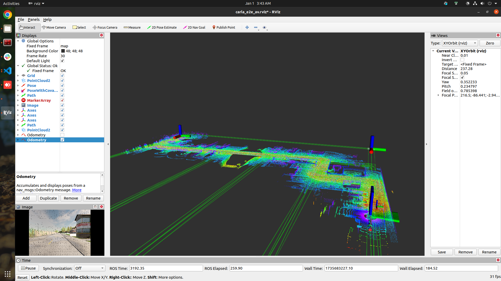
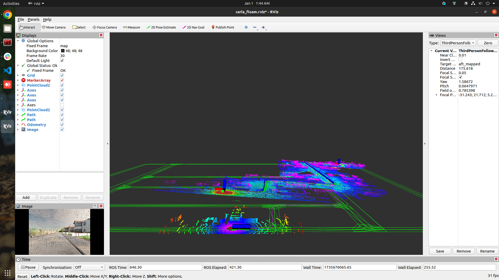

# Carla E2E AV Stack
This repository contains code for a perception and control stack for Autonomous Vehicle. Generally there are lots of part of AV development, perception, planning and control and there are different algorithm to be tested. Carla gives a very good plateform develop things there as well as test it. But, to do so, you have to have the basic pipeline ready. Maybe you just want to test some perception algorithm and pluge the output to planning and control to see how the vehicle behaves. This is where Carla E2E AV stack comes to the picture, which gives you simple planning and control solition and you can easyly pluge and play. 


currently its capable of,
- load any town's lanelet map
- spawn and set goal using rviz
- Use A-LOAM or SC-A-LOAM for odometry.
- evaluate odometry based on MSE-ATE, and scale error.
- Waypoint following using PID control.
- Run in both ROS1 and ROS2


Below are two separate tables summarizing **A-LOAM** and **SC-A-LOAM** performance based on latency and memory.

| **A-LOAM**            | **SC-A-LOAM**                            |
|--------------------------|--------------------------------------|
|||


---

### A-LOAM

| **Parameter**            | **Value**                            |
|--------------------------|--------------------------------------|
| **Odom Rate**            | 20 Hz (`/aft_mapped_path`)           |
| **Map Rate**             | 1 Hz (`/laser_cloud_map`)            |
| **RMS ATE**              | 0.9114 m                             |
| **Scale Error**          | 0.15%                                |
| **/alaserMapping**       | 159800 byte  (~159.8 KB)             |
| **/alaserOdometry**      | 142164 byte  (~142.164 KB)           |
| **/ascanRegistration**   | 32060 byte   (~32.06 KB)             |


### SC-A-LOAM

| **Parameter**                    | **Value**                            |
|----------------------------------|--------------------------------------|
| **Odom Rate**                    | 10 Hz (`/aft_pgo_path`)              |
| **Map Update**                   | 0.100 Hz (`/aft_pgo_map`)            |
| **Map Node**                     | 233.840 kb                           |
| **Odometry**                     | 142.240 kb                           |
| **PGO**                          | 110.800 kb                           |
| **Scan Registration**            | 32.004 kb                            |
| **RMS ATE**                      | 14 - 20 m                            |
| **Scale Error**                  | 0.37%                                |


### dependency
- Carla 0.9.11
- ROS1 noetic and ROS2 humble
- Ceres Solver , PCL and PCL-conversitions


### Run the code

run the AV stack without odometry from LOAM in ROS1

build:

```
$ git clone https://github.com/soumya997/carla-e2e-av-stack.git
$ cd carla-e2e-av-stack/ros1_ws
$ catkin_make
$ source devel/setup.bash
```


```
$ $CARLA_ROOT/CarlaUE4.sh -quality-level=Low -prefernvidia -nosound

$ cd /home/opencvuniv/carla-ros-bridge/catkin_ws && source devel/setup.bash
$ roslaunch carla_ros_bridge carla_ros_bridge.launch synchronous_mode:=True town:=Town01

$ cd /home/opencvuniv/carla-ros-bridge/catkin_ws && source devel/setup.bash
$ roslaunch carla_spawn_objects carla_example_ego_vehicle.launch spawn_sensors_only:=False objects_definition_file:=/home/opencvuniv/Work/somusan/robotics/nice_e2e_carla_av/trash/carla_e2e_ws/src/vehicle_ctrl/maps/objects.json

$ cd /home/opencvuniv/carla-ros-bridge/catkin_ws && source devel/setup.bash
$ roslaunch carla_waypoint_publisher carla_waypoint_publisher.launch

$ cd /home/opencvuniv/Work/somusan/robotics/nice_e2e_carla_av/trash/carla_e2e_ws && source devel/setup.bash
$ roslaunch vehicle_ctrl run_vehicle.launch

use the `2D Pose Estimate` to spawn a vehicle and `2D Nav Goal` to give the goal.
now, the car should be start running
```

run with A-LOAM/SC-A-LOAM


1. uncomment code under `# Subscriber to the LOAM odometry topic`, and comment out the code under `# Subscriber to the /carla/ego_vehicle/odometry topic`.
2. run A-LOAM code using the below code,

```
$ roslaunch aloam_velodyne aloam_velodyne_VLP_16_v2.launch lidar_topic:=/carla/ego_vehicle/lidar
$ python src/loam_utils/scripts/static_trf_broadcast.py
$ python src/loam_utils/scripts/aloam_odom_trf.py
```

3. run A-LOAM code using the below code,

```
$ roslaunch aloam_velodyne aloam_mulran.launch
$ python src/loam_utils/scripts/static_trf_broadcast.py
$ python src/loam_utils/scripts/aloam_odom_trf.py
```
